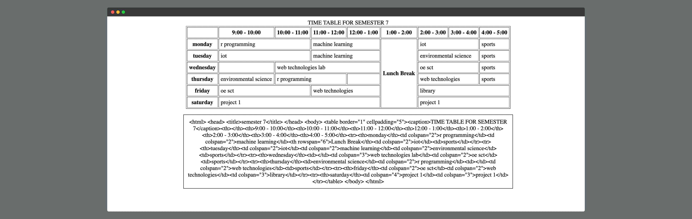

# Timetables-HTML-Generator

<center>
  
</center>

## Instructions
- clone the repo to get the code to your local machine
  ```bash
  git clone https://github.com/Royal-lobster/Timetables-HTML-Generator
  ```
- update the data.json with rest of the timetables
- open index.html with a browser for the generated codes and outputs


